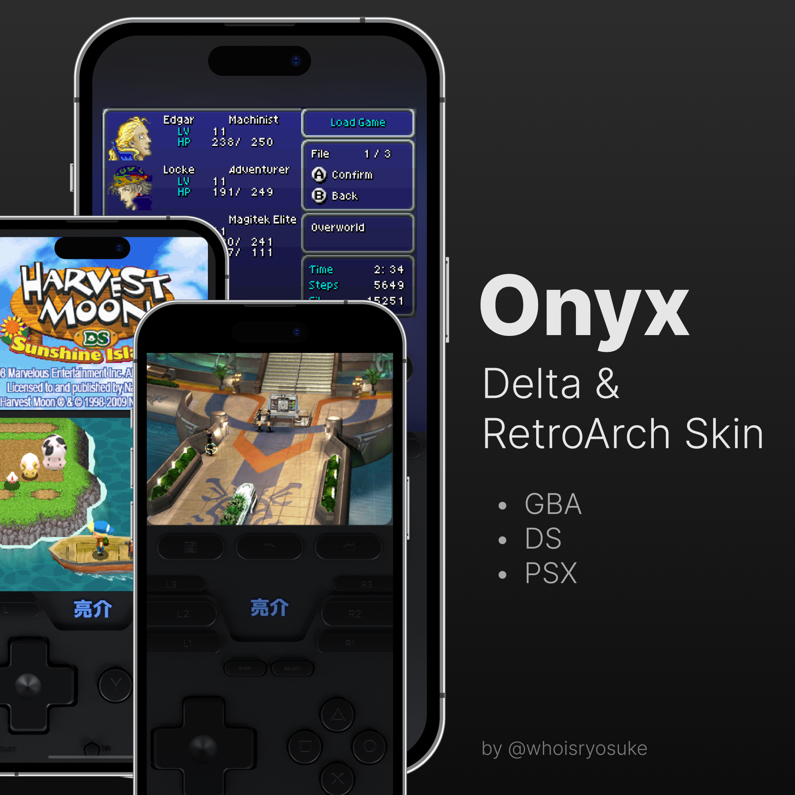

# Onyx Delta Skin

This is the home for the Onyx skin for the Delta app.

This is a 3D skin made using Blender to model a generic handheld gaming device.

# Download

Go to [the Releases section](https://github.com/whoisryosuke/delta-skin-onyx/releases), find the latest version, and it'll have a list of skins for each platform. You can also [find it on Gumroad](https://whoisryosuke.gumroad.com/l/onyx-delta-retroarch-skin?layout=profile).

# How to use

## Delta

The skins are in the "Delta Skins folder. I'll list them under the Releases section soon.

1. Download the `.deltaskin`
1. Import into Delta
1. Change to the skin in the settings.

## RetroArch

You can enable the “skins” (aka on screen overlays) in the settings for the emulator core.

1. Download the ZIP to your phone
1. Unzip the contents to the RetroArch folder under `overlays/gamepad/`
1. Start a game with the emulator core (aka "platform" like PSX) you want to skin
1. Open the settings
1. Go to game specific settings (first option)
1. Change on screen overlay
1. Browse for the skin where you extracted it and select the `.cfg` file

# How it works

Check out [my blog article](https://whoisryosuke.com/blog) to see how I made this.

The Blender files are named by their revision number (incrementing from R1 to R8+). The higher the number, the more up to date the skin is.

- R1 = Rough model
- R2 = Transparent with PCB
- R3 = Colored Glass
- R4 = Boolean attempt
- R5 = GBA V1
- R6 = Boolean success
- R7 = DS V1
- R8 = GBA Landscape V1
- R9 = DS Landscape V1
- R10 = PSX for RetroArch

# License

Do whatever you want, it's open source. Give me a shoutout if you're cool.

# Credits

- [Lux by Broank](https://broank.com/Delta.html)
