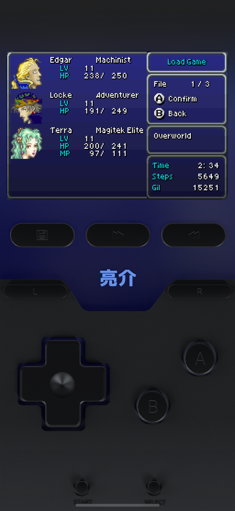

# Onyx Delta Skin

This is the home for the Onyx skin for the Delta app.

This is a 3D skin made using Blender to model a generic handheld gaming device.

# How to use

The skins are in the "Delta Skins folder. I'll list them under the Releases section soon.

1. Download the `.deltaskin`
1. Import into Delta
1. Change to the skin in the settings.

# How it works

Check out [my blog article](https://whoisryosuke.com/blog) to see how I made this.

The Blender files are named by their revision number (incrementing from R1 to R8+). The higher the number, the more up to date the skin is.

- R1 = Rough model
- R2 = Transparent with PCB
- R3 = Colored Glass
- R4 = Boolean attempt
- R5 = GBA V1
- R6 = Boolean success
- R7 = DS V1
- R8 = GBA Landscape V1
- R9 = DS Landscape V1

# License

Do whatever you want, it's open source. Give me a shoutout if you're cool.

# Credits

- [Lux by Broank](https://broank.com/Delta.html)
